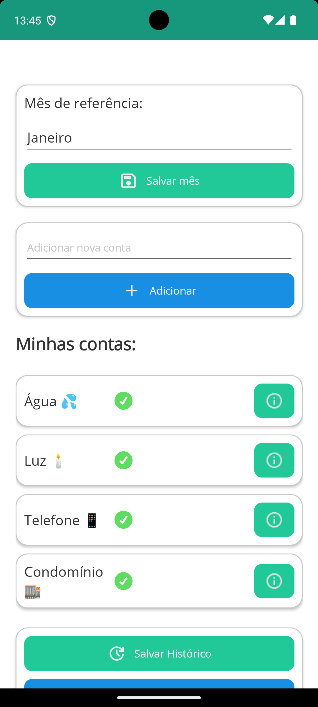
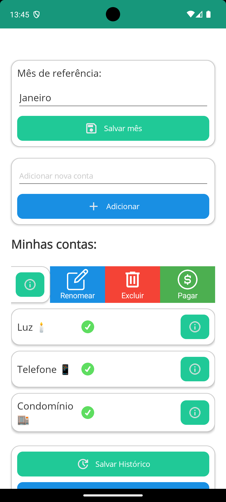
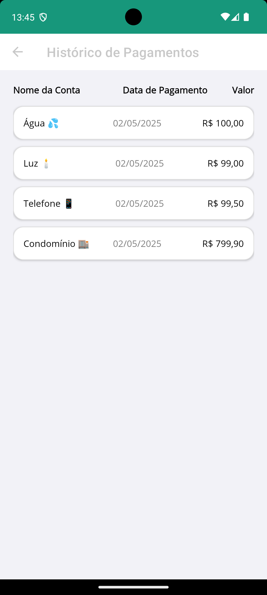
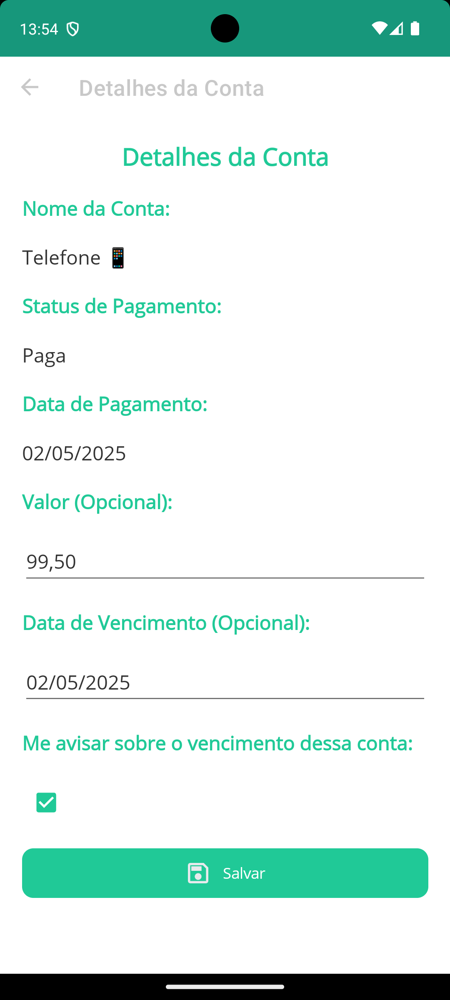
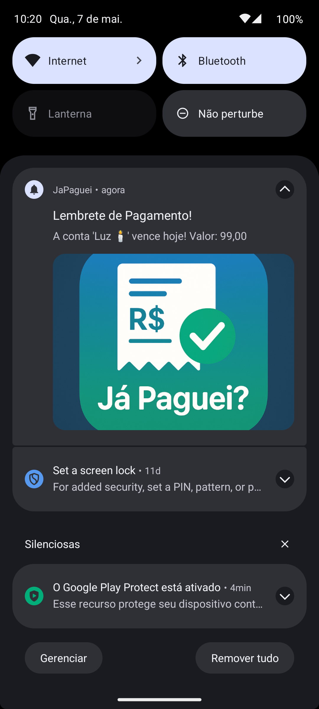

# Já Paguei 📋💰

Já Paguei é um aplicativo multi-plataforma desenvolvido com .NET MAUI para Android e iOS, que ajuda os usuários a gerenciar suas contas a pagar. Com ele, você pode cadastrar contas e marcar aquelas que já foram pagas, mantendo um controle fácil e intuitivo.

## Funcionalidades ✨

- 📅 **Mês de Referência**: Escolha o mês para o qual as contas serão cadastradas.
- 📝 **Cadastro de Contas**: Adicione novas contas a qualquer momento.
- ✅ **Marcar como Pago**: Marque suas contas como pagas e visualize a data do pagamento.
- ❌ **Remover Conta**: Remova contas facilmente com um simples toque.
- 💾 **Persistência de Dados**: As contas são salvas localmente usando Sqlite, garantindo que os dados estejam sempre disponíveis ao reabrir o app.
- 📣 **Notificações** : Envio de push notifications.

## Tecnologias Utilizadas 🛠

- **.NET MAUI**: Framework multi-plataforma para o desenvolvimento nativo.
- **C#**: Linguagem de programação principal.
- **XAML**: Para a criação de interfaces de usuário.
- **Sqlite**: Para persistência dos dados.
- **OneSignal**: Para envio e agendamento de Push Notifications.

## Como Funciona 🔧

1. **Selecionar Mês de Referência**: No topo do aplicativo, escolha o mês para o qual deseja cadastrar as contas.
2. **Adicionar Conta**: Preencha o campo "Adicionar nova conta" e clique no botão "Adicionar". A conta será listada abaixo.
3. **Editar Conta**: Adicione mais dados a sua conta, como Valor, data de vencimento e aviso de vencimento.
4. **Marcar como Pago**: Quando uma conta for paga, marque-a clicando no checkbox. A data de pagamento será automaticamente registrada.
5. **Remover Conta**: Para deletar uma conta, clique no botão de remoção (ícone de lixeira) ao lado da conta.
6. **Renomear Conta**: Para renomear uma conta, clique no botão de renomear ao lado da conta.
7. **Salvar Histórico de pagamentos**: Pague todas as contas do mês atual, e salve o histórico.
8. **Histórico das contas pagas**: Liste o histórico das contas pagas.

## Imagens do Aplicativo 📱

  
  
  
  
  

